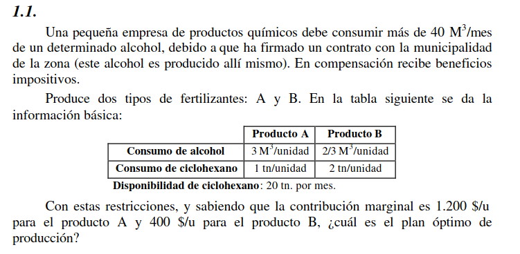
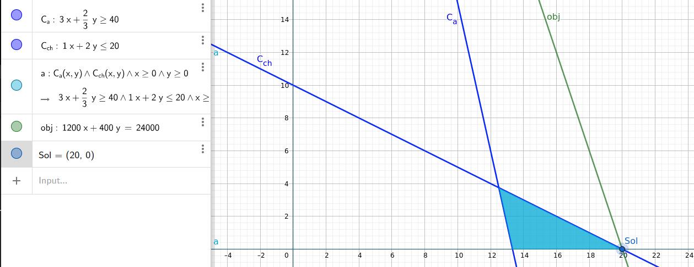

# Ejercicio 1.1

## Objetivo

Hay que determinar los productos de tipo A y de tipo B a vender en un mes, buscando maximizar las ganancias

## Hipótesis y Supuestos

- Todo lo que se produce, se vende
- No hay fallas en la fabricación de productos

## Identificación de variables de decisión controlables

$A$ = Cantidad de productos de tipo A a vender

$B$ = Cantidad de productos de tipo B a vender

$C_{a}$ = Consumo de alcohol

$C_{ch}$ = Consumo de ciclohexano

$G_{A}$ = Ganancia del producto A

$G_{B}$ = Ganancia del producto B

$$C_{a} = 3 \frac{M^2}{u} * A + \frac{2}{3} * \frac{M^2}{u} * B$$
$$C_{ch} = 1 \frac{tn}{u} * A + 2 * \frac{tn}{u} * B$$

$$G_{A} = \$1200*A$$
$$G_{B} = \$400*B$$

### Función Objetivo

$$Max(G_{A} + G_{B})$$

## Restricciones

$$C_{a} \geq 40 M^2$$
$$C_{ch} \leq 20 tn$$

## Representación Gráfica

## Solución Óptima

La solución óptima es producir 20 productos del tipo A y ninguno del tipo B
