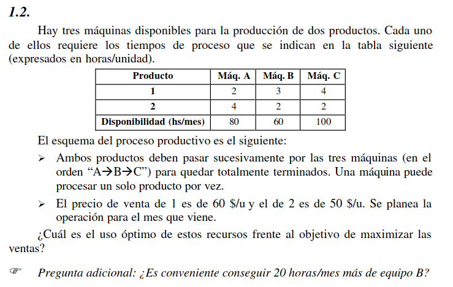
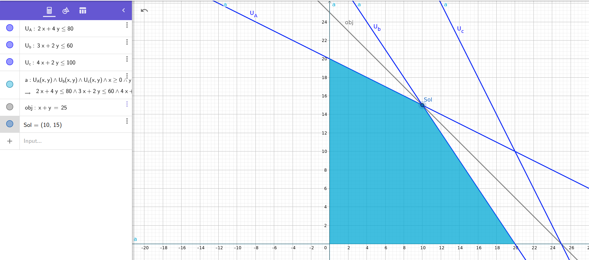

# Ejercicio 1.2

## Objetivo

Hay que determinar los productos de tipo A y de tipo B a vender en un mes, buscando maximizar las ventas

## Hipótesis y Supuestos

- Todo lo que se produce, se vende
- No hay fallas en la fabricación de productos

## Identificación de variables de decisión controlables

$A$ = Cantidad de productos de tipo 1 a vender

$B$ = Cantidad de productos de tipo 2 a vender

$U_{A}$ = Uso de la máquina A

$U_{B}$ = Uso de la máquina B

$U_{C}$ = Uso de la máquina C

$$U_{A} = 2 \frac{hs}{u} * X + 4 \frac{hs}{u} * Y$$
$$U_{B} = 3 \frac{hs}{u} * X + 2 \frac{hs}{u} * Y$$
$$U_{C} = 4 \frac{hs}{u} * X + 2 \frac{hs}{u} * Y$$

### Función Objetivo

$$Max(A + B)$$

## Restricciones

$$U_{A} \leq 80 hs$$
$$U_{B} \leq 60 hs$$
$$U_{C} \leq 100 hs$$

## Representación Gráfica

## Solución Óptima

La solución óptima es producir 10 productos del tipo 1 y 15 del tipo 2

## Pregunta adicional

> ¿Es conveniente conseguir 20 horas/mes más de equipo B?

Si, de ser la restricción de $U_B$ menor a 80 hs, el valor de productos vendidos sería de 30, en vez de 25.
