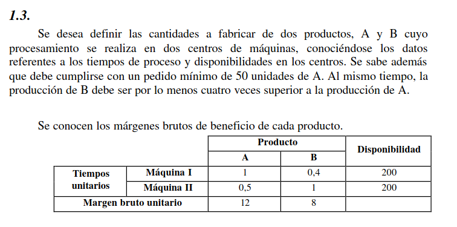
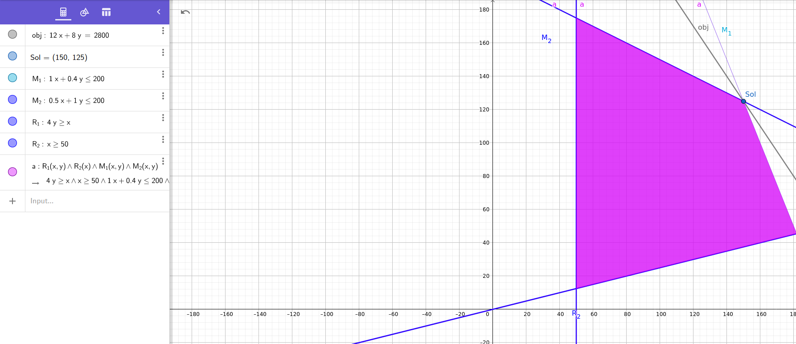

# Ejercicio 1.3

## Situacion problemática

Si bien el enunciado no aclara, vamos a tomar como supuesto que se busca definir las cantidades de productos a fabricar con el objetivo de maximizar las ganancias (y no, por ejemplo, las ventas).

También se toma como supuesto que estamos hablando en períodos mensuales.

## Objetivo

Hay que determinar los productos de tipo A y de tipo B a vender en un mes, buscando maximizar las ganancias

## Hipótesis y Supuestos

- Todo lo que se produce, se vende
- No hay fallas en la fabricación de productos

## Identificación de variables de decisión controlables

$A$ = Cantidad de productos de tipo A a vender

$B$ = Cantidad de productos de tipo B a vender

$M_1$ = Tiempos unitarios de uso de la máquina 1
$M_2$ = Tiempos unitarios de uso de la máquina 2

$G_A$ = Márgen bruto de A
$G_B$ = Márgen bruto de B

$$M_1 = 1 * A + 0.4 * B$$
$$M_2 = 0.5 * A + 1 * B$$

$$G_A = 12 * A$$
$$G_B = 8 * B$$

### Función Objetivo

$$Max(G_A + G_B)$$

## Restricciones

$$M_1 \leq 200 hs$$
$$M_2 \leq 200 hs$$
$$A \geq 50 hs$$
$$B \geq 4*A hs$$

## Representación Gráfica

## Solución Óptima

La solución óptima es producir 150 productos del tipo A y 125 del tipo B
