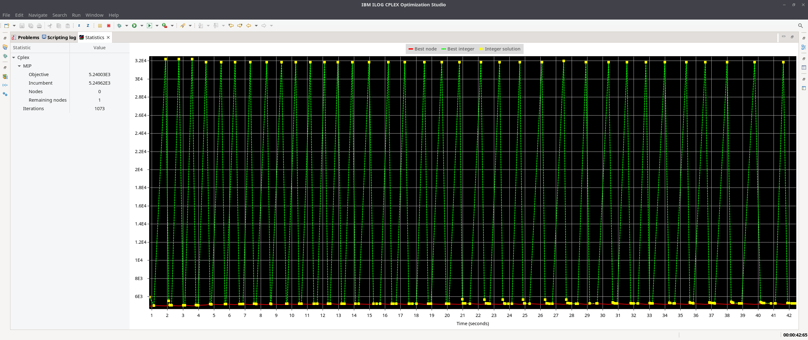
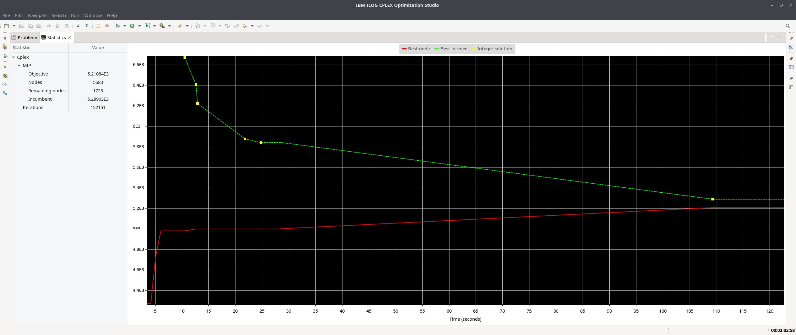
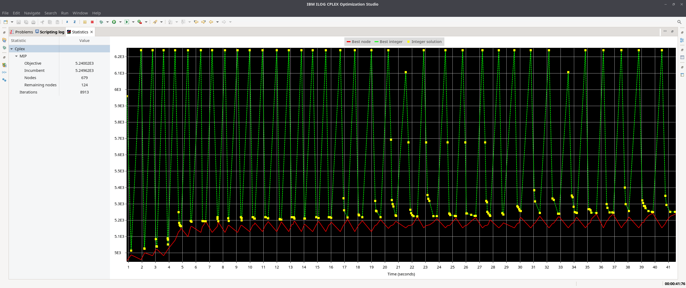
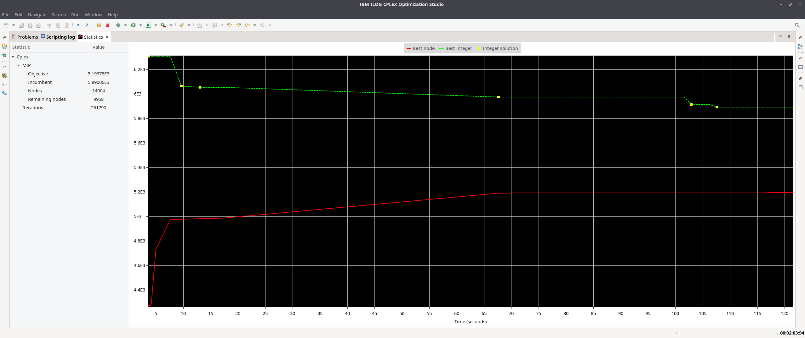

## Situacion problemática

Se tienen distintos bancos en el mapa a los cuales tengo que visitar exactamente una vez
a cada uno, y en cada banco que visite tengo que recaudar/depositar dinero, siempre
teniendo en cuenta que no puedo pasarme de ciertos límites. 

Se trata de un problema de optimización parecido al del viajante. Por un
lado, quiero que la distancia recorrida sea la mínima posible, y por el otro quiero
siempre asegurarme que el dinero que recaude no se pase de un monto fijo.

\begin{tikzpicture}
  \graph { subgraph K_n [n=10,clockwise,radius=5cm] };
\end{tikzpicture}

## Objetivo

Determinar el camino a hacer para minimizar la distancia, teniendo en cuenta que nunca
podemos tener saldo negativo ni salgo que supere un monto definido, durante un recorrido
del día.

## Hipótesis y Supuestos

- Es negligible la distancia entre la central y el primer banco que visite (ya que no
  tengo el dato)
- Nunca me roban en todo el trayecto, ni pierdo dinero
- No hay limitantes no especificados
- Los montos preestablecidos no cambian
- Todas las distancias entre bancos son conocidas y fijas
- La ruta entre bancos es siempre la misma, sin variar su distancia
- El monto inicial es cero

## Constantes

$CANT_{BANCOS} \in \mathbb{N}:$ Cantidad de bancos a visitar.

$CAPACIDAD \in \mathbb{N}:$ Cuanto dinero puede transportar el camión.

$DISTANCIA_{i, j} \in \mathbb{N}:$ Distancia del banco $i$ al banco $j$.

$DEMANDA_{i} \in \mathbb{N}:$ Cuanto dinero entrega o recibe el banco $i$.

## Variables de decisión controlables

$$BANCOS \in \{1...CANT_{BANCOS}\}$$

$Y_{i, j} \in \{0, 1\}:$ Variable bivalente que indica si el recorrido incluye ir del banco $i$ al banco $j$.

$U_{i} \in \mathbb{N}:$ Número de secuencia del banco $i$ en el recorrido.

$P_{i} \in \mathbb{N}_0:$ Plata que tiene el camión al llegar al punto $i$.

\footnotesize Adicionalmente, por fuera de las variables, $M$ es una constante de valor muy grande y $m$ es una constante de valor muy pequeño. \normalsize

## Vinculaciones y Restricciones

Solo se visita una vez cada banco. 

$$\sum_{\substack{i = 1\\ j \ne i}}^{BANCOS} Y_{i,j} = 1 \quad \forall j \in BANCOS$$

$$\sum_{\substack{j = 1\\ j \ne i}}^{BANCOS} Y_{i,j} = 1 \quad \forall i \in BANCOS$$

Evitamos subtours.

$$\forall i,j \in BANCOS$$ $$U_{i} - U_{j} + CANT_{BANCOS} Y_{i,j} \le CANT_{BANCOS} - 1 $$

En todo momento debo tener dinero (esto es redundante por la condición de
no-negatividad pero lo escribimos igual) y este dinero no debe superar la capacidad de
mi camión.

$$\forall i \in BANCOS$$ $$0 \leq P_{i} \leq CAPACIDAD$$

Vinculo la variable de dinero con la diferencia de demandas entre cada par de bancos.

$$\forall i,j \in BANCOS$$ $$-M * (1 - Y_{i,j}) + DEMANDA_j \leq P_j - P_i \leq DEMANDA_i
+ M * (1 - Y_{i,j})$$


## Función Objetivo

$$Min \: Z = \mathop{\sum\sum}_{\substack{i = 1 j = 1 \\ i \ne j}}^{BANCOS} Y_{i,j} * DISTANCIA_{i,j}$$

## CPLEX

Primero se corren ambos modelos sin ningún tipo de modificación





Luego, se modifica el código de CPLEX para insertar una solución inicial desde la cual
ambos modelos parten, la cual proviene de correr el código de `main.py`

```python
[1, 98, 87, 76, 73, 48, 63, 30, 84, 7, 8, 89, 96, 35, 93, 52, 33, 92, 54, 46, 90, 56, 26, 75, 18, 85, 65, 55, 58, 50, 70, 86, 29, 81, 25, 20, 51, 43, 67, 32, 23, 38, 77, 14, 80, 15, 78, 59, 16, 79, 88, 94, 10, 3, 62, 22, 4, 45, 71, 44, 64, 72, 49, 31, 27, 41, 57, 39, 60, 66, 17, 11, 61, 36, 69, 24, 12, 53, 40, 42, 9, 28, 6, 37, 2, 19, 99, 47, 83, 97, 100, 5, 95, 82, 34, 21, 68, 91, 13, 74]
```

Esta solución se inserta en ambos modelos

```C
int ordenInicial[Cities] = [1, 98, 87, 76, 73, 48, 63, 30, 84, 7, 8, 89, 96, 35, 93, 52, 33, 92, 54, 46, 90, 56, 26, 75, 18, 85, 65, 55, 58, 50, 70, 86, 29, 81, 25, 20, 51, 43, 67, 32, 23, 38, 77, 14, 80, 15, 78, 59, 16, 79, 88, 94, 10, 3, 62, 22, 4, 45, 71, 44, 64, 72, 49, 31, 27, 41, 57, 39, 60, 66, 17, 11, 61, 36, 69, 24, 12, 53, 40, 42, 9, 28, 6, 37, 2, 19, 99, 47, 83, 97, 100, 5, 95, 82, 34, 21, 68, 91, 13, 74];
int values[Edges];
execute {
  for ( var e in Edges) {
    values[e] = 0;
  }
  var ciudadAnterior = ordenInicial[n];
  for ( var i in Cities) {
    var ciudad = ordenInicial[i];
    if (ciudadAnterior < ciudad) {
      values[Edges.find(ciudadAnterior, ciudad)] = 1;
    } else {
      values[Edges.find(ciudad, ciudadAnterior)] = 1;
    }
    ciudadAnterior = ciudad;
  }
}
```

```C
int ordenInicial[cities] = [1, 98, 87, 76, 73, 48, 63, 30, 84, 7, 8, 89, 96, 35, 93, 52, 33, 92, 54, 46, 90, 56, 26, 75, 18, 85, 65, 55, 58, 50, 70, 86, 29, 81, 25, 20, 51, 43, 67, 32, 23, 38, 77, 14, 80, 15, 78, 59, 16, 79, 88, 94, 10, 3, 62, 22, 4, 45, 71, 44, 64, 72, 49, 31, 27, 41, 57, 39, 60, 66, 17, 11, 61, 36, 69, 24, 12, 53, 40, 42, 9, 28, 6, 37, 2, 19, 99, 47, 83, 97, 100, 5, 95, 82, 34, 21, 68, 91, 13, 74];
int values[edges];
execute {
  for ( var e in edges) {
    values[e] = 0;
  }
  var ciudadAnterior = ordenInicial[n];
  for ( var i in cities) {
    var ciudad = ordenInicial[i];
    values[edges.find(ciudadAnterior, ciudad)] = 1;
    ciudadAnterior = ciudad;
  }
}
```



