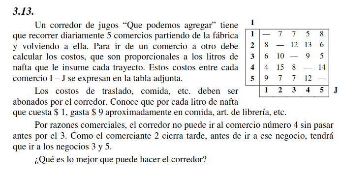

# Ejercicio 3.13

## Situación problemática

Se trata de un problema del viajante.

## Objetivo

Hay que determinar el orden de los 1s a visitar en un día, buscando minimizar los costos.

## Hipótesis y Supuestos

- El punto de partida es la fábrica
- No hay costos desde la fábrica hasta el primer comercio
- No hay costos desde el último comercio y la fábrica
- No hay costos adicionales
- No hay restricciones adicionales

## Identificación de variables de decisión controlables

Nota: En las siguientes variables, los 'puntos' del 1 al 5 identificarn al respectivo comercio, y el $0$ identifica a la fábrica (el punto de partida y de llegada)

$Y_{i,j} \quad (i,j \in \{ 0,1,2,3,4,5 \} ):$ Indica que el recorrido incluye ir desde el punto $i$ hasta el punto $j$

$C_{i,j} \quad (i,j \in \{ 0,1,2,3,4,5 \} ):$ Costo de ir desde $i$ hasta $j$

$U_i \quad (i \in \{ 0,1,2,3,4,5 \} ):$ Número de secuencia en el cual el punto $i$ es visitado

### Función Objetivo

$$Min(C_i,j) \quad \forall \{i,j\} \text{ } elegidos$$

## Restricciones

$$U_i - U_j + 5 * Y_{i,j} \leq 4 \quad \forall i,j = \{ 0,1,2,3,4,5 \} \wedge i \neq j$$
$$\sum_{i = 0;i \neq j}^{5} Y_{i,j}= 1 \quad \forall i = \{ 0,1,2,3,4,5 \}$$
$$\sum_{j = 0;i \neq j}^{5} Y_{i,j}= 1 \quad \forall j = \{ 0,1,2,3,4,5 \}$$

$$U_{3} \leq U_{4}$$
$$U_{3} \leq U_{2}$$
$$U_{5} \leq U_{2}$$
