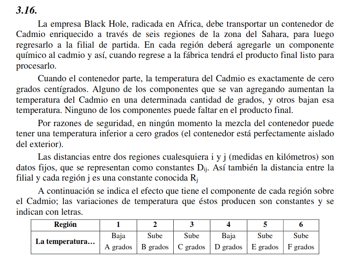

# Ejercicio 3.16

## Situacion problemática

Se trata de un problema del viajante.

## Objetivo

Hay que determinar el orden de las regiones a visitar a agregar al cadmio en el transcurso de un viaje, procurando siempre mantenerlo en una temperatura mayor o igual a cero grados, y buscando minimizar la distancia recorridas.

## Hipótesis y Supuestos

- No hay costos en los viajes relevantes al modelo
- Las distancias conocidas son fijas, sin cambios de ruta
- La manipulación del material no modifica el cambio de temperatura conocido
- El viaje no modifica el cambio de temperatura conocido

## Identificación de variables de decisión controlables

Nota: En las siguientes variables, los 'puntos' del 1 al 6 identifican a la respectiva región, y el 0 identifica a la filial (el punto de partida y de llegada)

$D_{i,j}  \: (i,j \in \{ 0,1,2,3,4,5,6 \} \wedge i \neq j ) \: [km]:$ Distancia entre el punto $i$ y el punto $j$. Si $i$ o $j$ es igual a 0, entonces se utiliza la variable $R_i$ del enunciado

$Y_{i,j} \: (i,j \in \{ 0,1,2,3,4,5,6 \} \wedge i \neq j ) \: [T/F]:$ Indica que el recorrido incluye ir desde el punto $i$ hasta el punto $j$

$U_i \: (i \in \{ 1,2,3,4,5,6 \}) \: [N]:$ Número de secuencia en el cual el punto $i$ es visitado

$Ti_i \: (i \in \{ 0,1,2,3,4,5,6 \}) \: [^{\circ}C]:$ Temperatura del contenedor en el punto $i$ después de aplicar el respectivo componente

$Ti_0 = 0$

## Función Objetivo

$$Min(\sum_{i=0}^6{D_{i,j}})$$

## Restricciones

$$\sum_{i = 0 \wedge i \neq j}^{6} Y_{i,j}= 1 \quad \forall i = \{ 0,1,2,3,4,5,6 \}$$
$$\sum_{j = 0 \wedge i \neq j}^{6} Y_{i,j}= 1 \quad \forall j = \{ 0,1,2,3,4,5,6 \}$$
$$U_i - U_j + 6 * Y_{i,j} \leq 5 \quad \forall i,j = \{ 0,1,2,3,4,5,6 \} \wedge i \neq j$$

$$Ti_{i} \geq 0 \quad \forall i \in {0,1,2,3,4,5,6}$$
