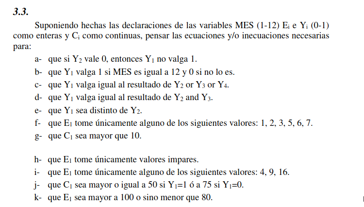

# Ejercicio 3.3

$$Y_1 \leq Y_2$$
$$11 Y_1 + 1 \leq MES \leq 11 + Y_1$$
$$ Y_1 \leq Y_2 + Y_3 + Y_4$$
$$ 2 Y_1 \leq Y_2 + Y_3 \leq 1 + Y_1 $$
$$ 1 - Y_1 = Y_2$$
$$ 1+ 4Y*{aux} \leq E_1 \leq 3 + 4 Y*{aux} $$
