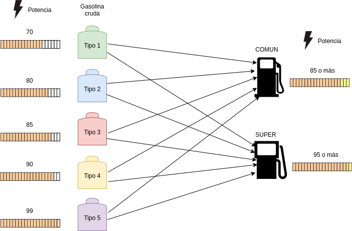

# Trabajo Práctico

Una refinería mezcla 5 tipos de gasolina cruda (Tipo 1, Tipo 2, Tipo 3, Tipo 4 y Tipo 5) para producir dos tipos de nafta para autos (común y súper).

La tabla muestra el número de barriles disponibles por día de cada tipo de gasolina cruda, la potencia de performance y el costo por barril.

| Gasolina cruda | Potencia | Barriles / día | Costo / barril |
| :------------: | :------: | :------------: | :------------: |
|     Tipo 1     |    70    |      2000      |      0.8       |
|     Tipo 2     |    80    |      4000      |      0.9       |
|     Tipo 3     |    85    |      4000      |      0.95      |
|     Tipo 4     |    90    |      5000      |      1.15      |
|     Tipo 5     |    99    |      3000      |       2        |

La nafta común debe tener una potencia de al menos 85 y la súper de al menos 95.

Los contratos de la refinería requieren que al menos se produzcan 8000 barriles por día de nafta súper.

El precio de venta es de $3.75 por barril de nafta súper y de $2.85 por barril de nafta común.

¿Qué es lo mejor que se puede hacer con la información disponible?

1. Redactar objetivo, hipótesis, plantear modelo por PLC y realizar una corrida con software.

2. Hacer un análisis detallado post optimal de la corrida del punto 1.

\newpage

## Situacion Problemática

Se trata de un problema de planificación de la producción con la particularidad de que se tienen mezclas de distintos tipos de gasolinas para producir 2 tipos de nafta como resultado.

Cada mezcla debe cumplir con un mínimo de potencia y se tiene una demanda mínima de barriles de nafta súper. También en la producción de la nafta se debe tener en cuenta el costo de cada tipo de combustible.

## Objetivo

Determinar la cantidad de los dos tipos de nafta a producir en un día para maximizar las ganancias totales.

## Hipótesis y Supuestos

- Las masas de las gasolinas son aditivas y lineales. Es decir, la cantidad final de barriles producidos en cada nafta es igual a la suma de las cantidades de barriles de las gasolinas que las componen.
- Se pueden producir cantidades arbitrariamente pequeñas de nafta.
- No es necesario mezclar todos los tipos de gasolina para producir un tipo de nafta. Es decir, puede no llegar a utilizarse algún tipo de gasolina para algún tipo de nafta y hasta puede ocurrir que la nafta esté compuesta por un solo tipo de gasolina.
- Las potencias son una combinación lineal de las potencias de los combustibles que componen a la nafta resultante.
- No se pierde volumen al mezclar la gasolina cruda
- No hay pérdidas de barriles en el proceso
- Los precios no varían en el periodo analizado
- No hay más costos que el de los barriles
- Toda la nafta producida va a venderse. No hay stock inicial ni final.
- El consumo de los recursos es directamente proporcional a la cantidad fabricada. No importan las proporciones finales de cada nafta mientras cumpla con las especificaciones. El resultado y su costo por barril no se verá afectado.
- Todos los barriles de gasolina no utilizados se desechan de un período a otro.
- Las constantes del modelo no varían.
- El período alcanza para producir tantos barriles de cada tipo de nafta como sea necesario.
- No hay materia prima ni productos defectuosos.
- Se pueden usar fracciones de barriles para la produccion de nafta, en vez de dedicar un barril entero para cada barril de nafta producido.

## Identificación de variables de decisión controlables

$G_{i,k}  \: (i \in \{ 1,2,3,4,5 \} \wedge k \in \{C,S\} ) \: [barriles/día]:$ Gasolina de tipo $i$ destinada a producir nafta del tipo $k$ ($C$ por común, $S$ por super)

$N_k  \: (k \in {C,S} ) \: [barriles/día]:$ Nafta de tipo $k$ producida \

La nafta se obtiene de la mezcla de 5 tipos de gasolina
$$N_C = \sum_{i = 1}^{5} G_{i,C}$$
$$N_S = \sum_{i = 1}^{5} G_{i,S}$$

## Restricciones

Límites de barriles diarios
$$G_{1,C}+G_{1,S} \leq 2000$$
$$G_{2,C}+G_{2,S} \leq 4000$$
$$G_{3,C}+G_{3,S} \leq 4000$$
$$G_{4,C}+G_{4,S} \leq 5000$$
$$G_{5,C}+G_{5,S} \leq 3000$$

Se requieren al menos 8000 barriles de nafta súper
$$N_S \geq 8000$$

La nafta común debe tener una potencia de al menos 85
$$G_{1,C} * 70 + G_{2,C} * 80 + G_{3,C} * 85 + G_{4,C} * 90 + G_{5,C}* 99 \geq N_C * 85$$

La nafta súper debe tener una potencia de al menos 95
$$G_{1,S} * 70 + G_{2,S} * 80 + G_{3,S} * 85 + G_{4,S} * 90 + G_{5,S}* 99 \geq N_S * 95$$

## Función Objetivo

$$
Ganancias = 2.85 * N_C + 3.75 * N_S
$$

$$
Costos =
0.8 * (G_{1,C} + G_{1,S}) +  0.9 * (G_{2,C} + G_{2,S}) + 0.95 * (G_{3,C} + G_{3,S}) +
1.15 * (G_{4,C} + G_{4,S}) + 2 * (G_{5,C} + G_{5,S})
$$

$$ Max Z = Ganancias - Costos $$

## Solución y Análisis Post Optimal

Como se puede ver en el anexo, la corrida de `GLPK` devuelve que no hay solución optima para las restricciones dadas, y por ende el problema es incompatible. Analizando el problema, buscamos por el absurdo el contraejemplo que demuestre que, efectivamente, no hay semejante solucion:

> Se quieren producir 8000 barriles de nafta super, con una potencia de al menos 95. Pero, si tomamos los 5000 barriles de gasolina cruda de tipo 4, y los 3000 barriles de gasolina cruda de tipo 5, mientras que su suma sí daría 8000 barriles, la combinación de potencia será de 93.375.

Por supuesto que tomar cualquier otra combinación de gasolinas crudas devolvería una potencia aun menor que la generada por la solucion propuesta, considerando que las gasolinas de tipo 4 y 5 son las de mayor potencia.

Habiendo demostrado que no hay solución óptima, solo nos queda preguntarnos como subsanar los conflictos de las restricciones dadas.

Las modificaciones que se pueden hacer para llegar a una solución que cumpla con lo pedido puede ser cualquiera de las siguientes opciones, o bien una combinación adecuada de todos los puntos listados:

- Se deben producir menos barriles de nafta super por día, en vez de 8000

  - Al producir 5000 barriles provenientes de 3000 de gasolina de tipo 5 y 2000 de gasolina de tipo 4, se llega a una potencia de nafta super de 95.4

- Se debe conseguir un nuevo tipo de gasolina cruda, de mayor potencia que la gasolina de tipo 5, procurando que haya los suficientes barriles para llegar a los 8000 por día de nafta super

  - Al combinar 3000 barriles de una gasolina cruda hipotética de tipo 6 que tenga una potencia de 104, con los 5000 barriles de tipo 4, se consiguen 8000 barriles de nafta super de 95.25 de potencia

- Se debe aumentar la cantidad de barriles de gasolina de tipo 5 de tal manera que se cumpla la restricción de 8000 barriles diarios

  - Se pueden usar 8000 barriles de tipo 5

  - Se pueden usar unos 3500 barriles de tipo 4, y 4500 de tipo 5, así llegando a una potencia de 95.0625

- Se debe producir nafta super con menor potencia a 95

  - Se puede buscar una potencia de al menos 93

Tomando por supuesto que la restricción de producir al menos 8000 barriles de nafta super por día es la más restrictiva (valga la redundancia) de todas las conflictivas, y que es la más facil de subsanar, se puede hacer una corrida del modelo sin esta restricción, llegando así a una solución optima: generar $32080 de ganancias, produciendo 16300 barriles de nafta comun y 1700 de nafta super. Las especificaciones de esta corrida estan presentes en el anexo de este informe.

\newpage

## Software: `TP.mod`

\lstinputlisting{TP.mod}

\newpage

## Solución con `GLPK`: `TP.sol`

\lstinputlisting{TP.sol}

\newpage

## Solución con `GLPK` sin la restricción de producir 8000 barriles de nafta super: `TP-mod.sol`

\lstinputlisting{TP-mod.sol}
