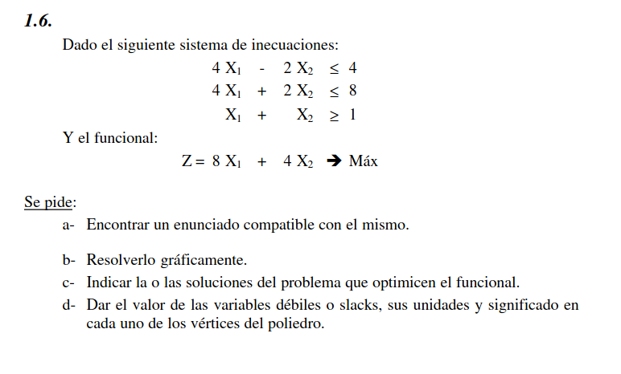
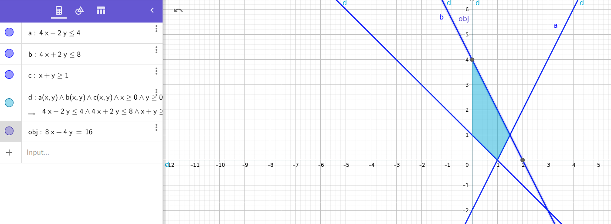

# Ejercicio 1.6

## Enunciado compatible

> Una empresa produce dos tipos de productos, A y B, que consumen y/o producen cloro y sal al ser fabricados. El producto A consume 4 unidades de cloro mientras que produce 2 de sal, el producto B consume 4 unidades de cloro y 2 unidades de sal.
> Al finalizar el mes, el consumo del cloro debe ser menor a 4 unidades y el de la sal mayor a 8.
> Al finalizar el mes, se debe haber producido al menos una unidad de cloro o de sallas v
> Se busca maximizar el consumo de sal y cloro de la fabrica, siempre y cuando el consumo del cloro sea el doble que el de la sal.

## Representación Gráfica

## Solución Óptima

La solución óptima es cualquiera de las alineadas entre el (0,4) y el (1.5,1)
